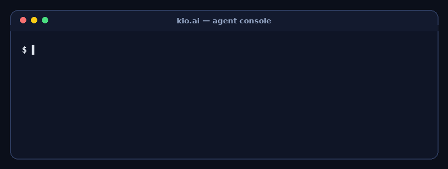
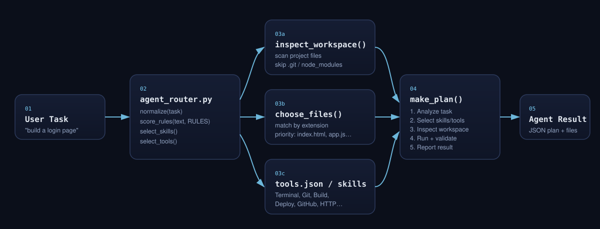
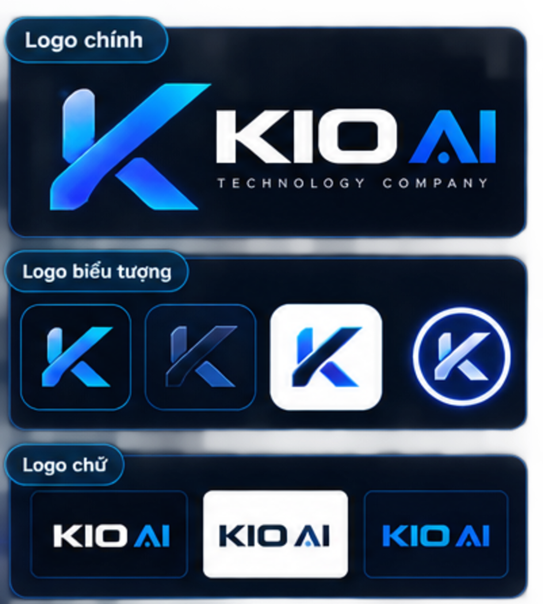
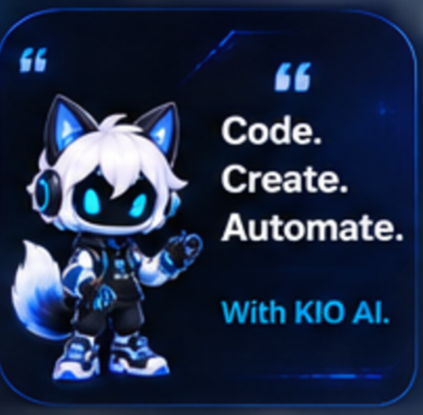
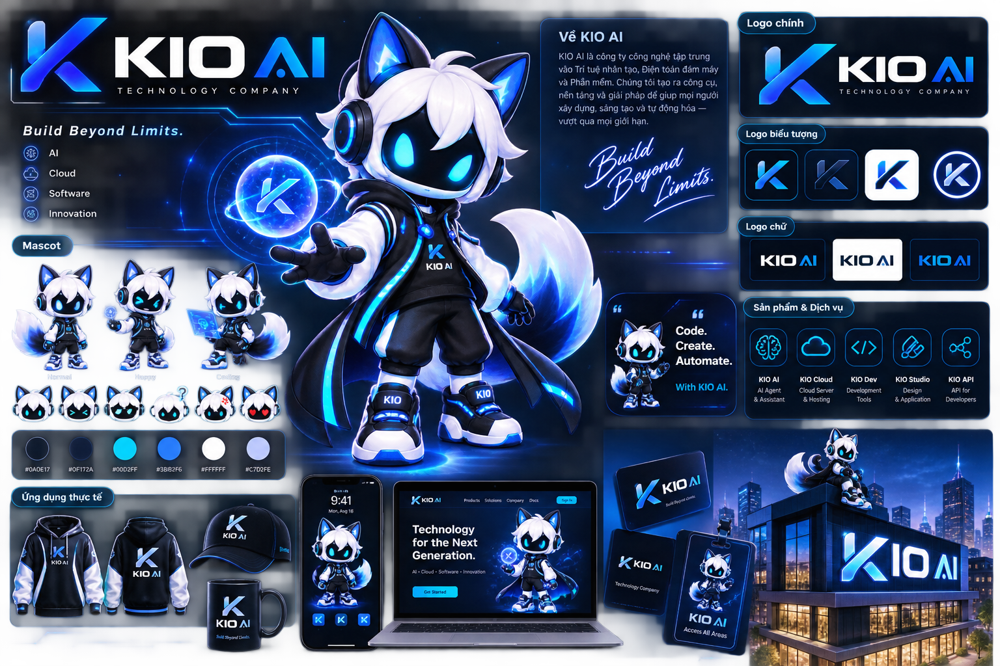
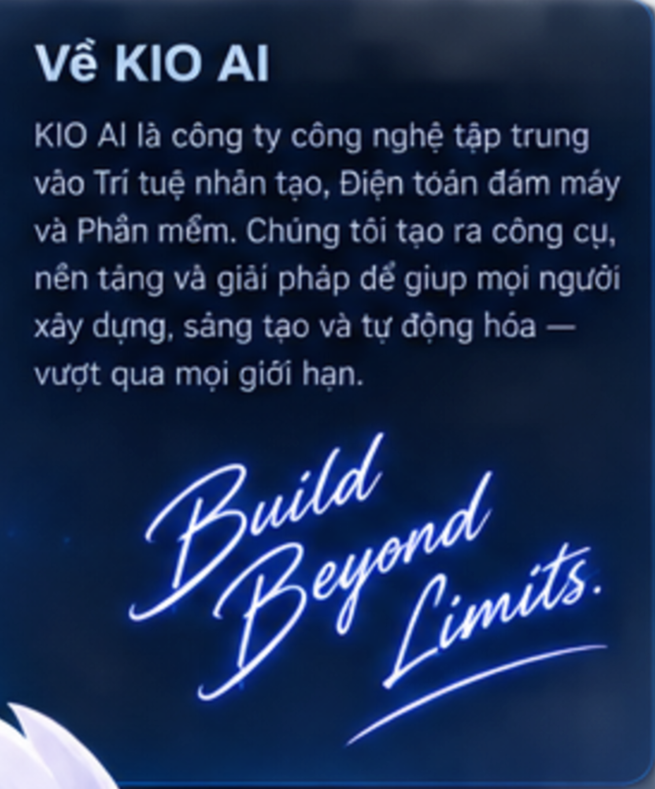

<div align="center">



<br/>

[](https://github.com/zskbot)
[](https://github.com/zskbot/kio.ai)
[](#-license)
[](#)

**KIO.ai** — trợ lý lập trình dạng *Agent* tự chọn **skill** và **tool** phù hợp cho từng tác vụ, quét workspace, lên kế hoạch thực thi và báo cáo kết quả.

</div>

<br/>

## 📚 Mục lục

- [Giới thiệu](#-giới-thiệu)
- [Demo](#-demo)
- [Kiến trúc hoạt động](#-kiến-trúc-hoạt-động)
- [Tính năng nổi bật](#-tính-năng-nổi-bật)
- [Bộ công cụ (Tools)](#-bộ-công-cụ-tools)
- [Bộ kỹ năng (Skills)](#-bộ-kỹ-năng-skills)
- [Cấu trúc dự án](#-cấu-trúc-dự-án)
- [Bắt đầu nhanh](#-bắt-đầu-nhanh)
- [Cấu hình](#-cấu-hình)
- [Lộ trình phát triển](#-lộ-trình-phát-triển)
- [Đóng góp](#-đóng-góp)
- [Giấy phép](#-giấy-phép)
- [Tác giả](#-tác-giả)

<br/>

## ✨ Giới thiệu

**KIO.ai** là một *AI coding agent* chạy trên nền **Python** (`server.py`, `agent_router.py`) kết hợp giao diện web nhẹ (`index.html`, `app.js`, `style.css`). Trái tim của dự án là bộ định tuyến (`agent_router.py`): với mỗi yêu cầu người dùng, KIO sẽ:

1. **Chuẩn hoá** nội dung tác vụ (`normalize`)
2. **Chấm điểm** và chọn ra các **skill** & **tool** liên quan nhất (`select_skills`, `select_tools`)
3. **Quét workspace** để nắm cấu trúc thư mục (`inspect_workspace`)
4. **Lọc ra các tệp** bị ảnh hưởng theo phần mở rộng & độ ưu tiên (`choose_files`)
5. **Lập kế hoạch thực thi** từng bước (`make_plan`) và trả kết quả dạng JSON

Nhờ vậy, KIO có thể tự thích ứng với nhiều loại tác vụ khác nhau — từ dựng giao diện web, sửa lỗi backend, chạy test, cho tới thao tác Git/GitHub và triển khai dự án — mà không cần cấu hình thủ công cho từng trường hợp.

<br/>

## 🎬 Demo

<div align="center">

</div>

<br/>

## 🧠 Kiến trúc hoạt động



> Luồng xử lý: **Task → Router (score & chọn skill/tool) → Quét workspace & chọn file → Lập kế hoạch → Trả kết quả.**

<br/>

## 🚀 Tính năng nổi bật

| | Tính năng | Mô tả |
|---|---|---|
| 🧩 | **Router thông minh** | Chấm điểm từ khoá để tự chọn skill/tool phù hợp nhất với từng yêu cầu |
| 📁 | **Quét workspace** | Tự động liệt kê file dự án, bỏ qua `.git`, `node_modules`, `.venv`, `.env` |
| 🎯 | **Chọn file ưu tiên** | Ưu tiên các tệp lõi như `index.html`, `style.css`, `app.js`, `server.py` |
| 🗺️ | **Lập kế hoạch từng bước** | Sinh plan rõ ràng: phân tích → chọn skill/tool → quét → build → validate → báo cáo |
| 🔌 | **Kiến trúc plugin** | Mở rộng qua `plugins.json`, `plugins/`, `skills/` |
| 🌐 | **Giao diện web nhẹ** | `index.html` + `app.js` + `style.css`, không phụ thuộc framework nặng |
| 🐙 | **Tích hợp Git/GitHub** | Hỗ trợ thao tác repo, branch, pull request ngay trong agent |

<br/>

## 🛠 Bộ công cụ (Tools)

| Tool | Nhóm | Icon | Mô tả |
|---|---|:---:|---|
| `terminal` | Core | ⌘ | Chạy lệnh dự án qua KIO build console |
| `file-manager` | Core | ◇ | Kiểm tra file & cấu trúc workspace |
| `code-search` | Core | ⌕ | Tìm kiếm và định vị code liên quan |
| `build` | Build | ▶ | Chạy build và các bước kiểm chứng dự án |
| `test` | Build | ✓ | Chạy test và báo cáo lỗi |
| `git` | Developer | ⑂ | Kiểm tra trạng thái repo, chuẩn bị thao tác Git |
| `github` | Developer | ◈ | Tích hợp repository, issue, pull request |
| `deploy` | Developer | ↑ | Chuẩn bị luồng triển khai cho các nền tảng hỗ trợ |
| `browser` | Web | ◎ | Kiểm tra giao diện & xác thực ứng dụng web |
| `http` | Web | ↗ | Kiểm tra API và HTTP endpoint |

<br/>

## 🧬 Bộ kỹ năng (Skills)

`agent_router.py` chấm điểm từ khoá để chọn tối đa **4 skill** phù hợp nhất cho mỗi tác vụ:

`frontend` · `backend` · `debugging` · `testing` · `git-workflow` · `deployment` · `project-analysis`

Nếu không có từ khoá nào khớp, KIO mặc định dùng skill `project-analysis` (tools: `file-manager`, `code-search`, `build`) để đảm bảo luôn có hướng xử lý an toàn.

<br/>

## 🗂 Cấu trúc dự án

```text
kio.ai/
├── .github/            # Workflow / cấu hình GitHub
├── assets/             # Ảnh, banner, tài nguyên tĩnh
├── backup/             # Bản sao lưu
├── plugins/            # Plugin mở rộng cho agent
├── skills/             # Định nghĩa các skill
├── agent_router.py     # Bộ định tuyến task → skill/tool → plan
├── server.py           # Backend phục vụ agent & giao diện
├── index.html           # Giao diện web
├── app.js               # Logic phía client
├── style.css             # Giao diện style
├── plugins.json         # Danh sách plugin đăng ký
├── tools.json           # Danh mục tool khả dụng
├── .env.example          # Mẫu biến môi trường
└── README.md
```

<br/>

## ⚡ Bắt đầu nhanh

```bash
# 1. Clone dự án
git clone https://github.com/zskbot/kio.ai.git
cd kio.ai

# 2. Cấu hình biến môi trường
cp .env.example .env
# → mở .env và điền các giá trị cần thiết (API key, cổng chạy, v.v.)

# 3. Cài đặt phụ thuộc Python (nếu có requirements riêng)
pip install -r requirements.txt   # bỏ qua nếu dự án không có file này

# 4. Khởi chạy server
python server.py
```

Sau khi server chạy, mở trình duyệt tới địa chỉ được `server.py` in ra (mặc định thường là `http://localhost:PORT`) để sử dụng giao diện KIO.

<br/>

## ⚙️ Cấu hình

Toàn bộ biến môi trường cần thiết được liệt kê mẫu trong [`.env.example`](./.env.example). Hãy sao chép thành `.env` và cập nhật theo môi trường của bạn trước khi chạy `server.py`.

Danh sách tool khả dụng có thể mở rộng qua [`tools.json`](./tools.json) và plugin đăng ký qua [`plugins.json`](./plugins.json).

<br/>

## 🧭 Lộ trình phát triển

- [ ] Mở rộng thêm skill chuyên biệt theo ngôn ngữ/framework
- [ ] Thêm giao diện quản lý plugin trực quan
- [ ] Hỗ trợ đa nền tảng triển khai (deploy) mở rộng
- [ ] Viết bộ test tự động cho `agent_router.py`

<br/>

## 🤝 Đóng góp

Mọi đóng góp đều được chào đón!

1. Fork dự án
2. Tạo nhánh tính năng: `git checkout -b feature/ten-tinh-nang`
3. Commit thay đổi: `git commit -m "feat: mo ta thay doi"`
4. Push nhánh: `git push origin feature/ten-tinh-nang`
5. Mở Pull Request

<br/>

## 📄 Giấy phép

Phát hành theo giấy phép **MIT** — xem chi tiết tại file `LICENSE` (nếu có) trong repository.

<br/>

## 👤 Tác giả

<div align="center">

**Huỳnh Thương ❤️**

Chủ dự án · Thiết kế & phát triển KIO.ai

[](https://github.com/zskbot)

</div>

<div align="center">



# KIO AI
### Build Beyond Limits.

**AI · Cloud · Software · Innovation**

</div>

---

## 📖 Về KIO AI

<table>
<tr>
<td width="55%" valign="top">

KIO AI là công ty công nghệ tập trung vào **Trí tuệ nhân tạo**, **Điện toán đám mây** và **Phần mềm**.

Chúng tôi tạo ra công cụ, nền tảng và giải pháp để giúp mọi người xây dựng, sáng tạo và tự động hóa — vượt qua mọi giới hạn.

> *"Code. Create. Automate. With KIO AI."*

</td>
<td width="45%">

</td>
</tr>
</table>

---

## 🎨 Bộ nhận diện thương hiệu (Brand Overview)

<div align="center">

</div>

Bộ nhận diện đầy đủ bao gồm: logo chính, logo biểu tượng, logo chữ, hệ màu, mascot ở nhiều biểu cảm, và ứng dụng thực tế (áo hoodie, nón, cốc, giao diện web/app, name tag, biển hiệu).

---

## 🏢 Ứng dụng thương hiệu (Brand Applications)

<div align="center">

</div>

Hình ảnh minh họa mascot và logo KIO AI trên các nền tảng thực tế: giao diện web/app, thẻ nhân viên (badge), và biển hiệu tòa nhà.

---

## 🔤 Hệ thống Logo (Logo System)

<div align="center">

</div>

| Loại | Mô tả |
|---|---|
| **Logo chính** | Biểu tượng K + tên đầy đủ "KIO AI Technology Company" |
| **Logo biểu tượng** | 4 biến thể chữ K dùng cho favicon, app icon, avatar |
| **Logo chữ** | 3 phiên bản wordmark cho nền tối / nền sáng / nền xanh |

---

## 🐺 Mascot & Giới thiệu

<div align="center">

</div>

---

<div align="center">

**KIO AI** — *Build Beyond Limits.*

[Website](#) · [Docs](#) · [Products](#)

</div>